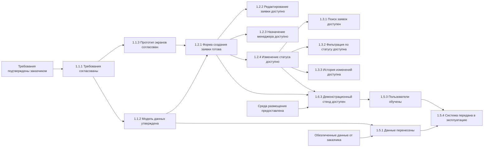

# Карта зависимостей проекта

Карта показывает основные зависимости между результатами проекта и внешними условиями, необходимыми для разработки и передачи системы в эксплуатацию.

```mermaid
graph LR
    A[Требования подтверждены заказчиком] --> B[1.1.1 Требования согласованы]
    B --> C[1.1.2 Модель данных утверждена]
    B --> D[1.1.3 Прототип экранов согласован]

    C --> E[1.2.1 Форма создания заявки готова]
    D --> E

    E --> F[1.2.2 Редактирование заявки доступно]
    E --> G[1.2.3 Назначение менеджера доступно]
    E --> H[1.2.4 Изменение статуса доступно]

    H --> I[1.3.1 Поиск заявок доступен]
    H --> J[1.3.2 Фильтрация по статусу доступна]
    H --> K[1.3.3 История изменений доступна]

    L[Обезличенные данные от заказчика] --> M[1.5.1 Данные перенесены]
    C --> M

    N[Среда размещения предоставлена] --> O[1.6.3 Демонстрационный стенд доступен]

    E --> O
    H --> O

    O --> P[1.5.3 Пользователи обучены]
    M --> Q[1.5.4 Система передана в эксплуатацию]
    P --> Q
```
